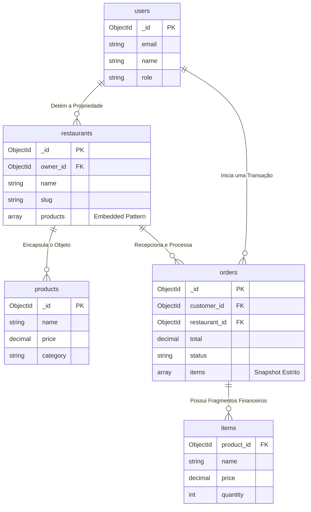

# 6. Modelagem de Dados (MongoDB)

Este documento especifica o design da base de dados não-relacional do Cardápio Online. O esquema prioriza alta performance de leitura (Read-Heavy Operations) típica de sistemas de e-commerce e delivery.

---

## Sumário

- [6.1 Estratégia Estrutural](#61-estratégia-estrutural)
- [6.2 Coleção de Identidades: `users`](#62-coleção-de-identidades-users)
- [6.3 Coleção de Tenants: `restaurants`](#63-coleção-de-tenants-restaurants)
- [6.4 Coleção Transacional: `orders`](#64-coleção-transacional-orders)
- [6.5 Mapa de Entidade-Relacionamento (ERD)](#65-mapa-de-entidade-relacionamento-erd)
- [6.6 Validação de Schema Nativa](#66-validação-de-schema-nativa)

---

## 6.1 Estratégia Estrutural

A modelagem de dados foi arquitetada combinando os padrões estritos de bancos NoSQL voltados para escalabilidade horizontal:
* **Embedded Document Pattern:** Produtos são embutidos diretamente nos restaurantes, visto que raramente são acessados de maneira isolada de seu tenant e o limite de array não excede a restrição de 16MB de um documento BSON.
* **Extended Reference Pattern:** Pedidos referenciam os usuários, mas executam "snapshots" pontuais dos preços e nomes dos produtos. Isso impede a alteração retrospectiva de uma nota fiscal se um dono de restaurante alterar o preço de um hambúrguer no futuro.

---

## 6.2 Coleção de Identidades: `users`

A coleção de *users* age como a matriz global de acesso, agrupando clientes finais e gestores na mesma estrutura lógica mediante isolamento por flag de escopo (`role`).

```json
{
  "_id": "ObjectId()",
  "email": "string (Indexado, Unique)",
  "password_hash": "string | null",
  "name": "string",
  "phone": "string | null",
  "role": "string (enum: 'customer', 'owner')",
  "avatar_url": "string | null (URL Absoluta AWS S3)",
  "google_id": "string | null (Indexado Sparse, Unique)",
  "addresses": [
    {
      "label": "string (ex: Residência)",
      "street": "string",
      "number": "string",
      "complement": "string | null",
      "neighborhood": "string",
      "city": "string",
      "state": "string",
      "zip_code": "string",
      "is_default": "boolean"
    }
  ],
  "is_active": "boolean",
  "created_at": "ISODate()",
  "updated_at": "ISODate()"
}
```

### Índices de Performance (`users`)
```javascript
db.users.createIndex({ "email": 1 }, { unique: true })
db.users.createIndex({ "google_id": 1 }, { unique: true, sparse: true })
db.users.createIndex({ "role": 1 })
```

---

## 6.3 Coleção de Tenants: `restaurants`

A coleção `restaurants` é a estrutura de maior densidade no sistema. Ao englobar a grade de *business_hours* e os *products*, ela permite a renderização completa de uma página de restaurante sem a necessidade de gerar sub-consultas (*JOIN/Lookup*).

```json
{
  "_id": "ObjectId()",
  "owner_id": "ObjectId() (Ref: users)",
  "name": "string",
  "slug": "string (Indexado, Unique)",
  "description": "string",
  "cover_image_url": "string",
  "logo_url": "string | null",
  "contact": {
    "phone": "string",
    "email": "string | null",
    "whatsapp": "string | null"
  },
  "address": {
    "street": "string",
    "number": "string",
    "neighborhood": "string",
    "city": "string",
    "state": "string",
    "zip_code": "string",
    "coordinates": {
      "lat": "number",
      "lng": "number"
    }
  },
  "business_hours": [
    {
      "day": "integer (0=Domingo, 6=Sábado)",
      "open": "string (Formato HH:MM)",
      "close": "string (Formato HH:MM)",
      "is_closed": "boolean"
    }
  ],
  "categories": ["string"],
  "products": [
    {
      "_id": "ObjectId()",
      "name": "string",
      "description": "string",
      "price": "number (Decimal128)",
      "category": "string (enum)",
      "image_url": "string",
      "is_available": "boolean",
      "sort_order": "integer",
      "created_at": "ISODate()",
      "updated_at": "ISODate()"
    }
  ],
  "status": "string (enum: 'active', 'inactive', 'suspended')",
  "rating": {
    "average": "number (escala 0-5)",
    "count": "integer"
  },
  "created_at": "ISODate()",
  "updated_at": "ISODate()"
}
```

### Índices de Performance (`restaurants`)
```javascript
db.restaurants.createIndex({ "slug": 1 }, { unique: true })
db.restaurants.createIndex({ "owner_id": 1 })
db.restaurants.createIndex({ "status": 1 })
db.restaurants.createIndex({ "name": "text", "description": "text" })
db.restaurants.createIndex({ "address.coordinates": "2dsphere" })
db.restaurants.createIndex({ "products.category": 1 })
```

---

## 6.4 Coleção Transacional: `orders`

Documentos de ordem de serviço são estruturas imutáveis que operam como registros contábeis, armazenando em suas matrizes o valor monetário real acordado no ato do checkout.

```json
{
  "_id": "ObjectId()",
  "order_number": "string (Unique, Prefixo: ORD-2026-X)",
  "customer_id": "ObjectId() (Ref: users)",
  "restaurant_id": "ObjectId() (Ref: restaurants)",
  "items": [
    {
      "product_id": "ObjectId()",
      "name": "string (Snapshot Congelado)",
      "price": "number (Decimal128)",
      "quantity": "integer",
      "subtotal": "number (Decimal128)",
      "image_url": "string"
    }
  ],
  "total": "number (Decimal128)",
  "status": "string (enum: 'pending', 'confirmed', 'preparing', 'ready', 'delivered', 'cancelled')",
  "status_history": [
    {
      "status": "string",
      "changed_at": "ISODate()",
      "changed_by": "ObjectId() (Ref: users)"
    }
  ],
  "delivery_method": "string (enum: 'delivery', 'pickup')",
  "delivery_address": {
    "street": "string",
    "number": "string",
    "neighborhood": "string",
    "city": "string",
    "state": "string",
    "zip_code": "string"
  },
  "notes": "string | null",
  "created_at": "ISODate()",
  "updated_at": "ISODate()"
}
```

### Índices de Performance (`orders`)
```javascript
db.orders.createIndex({ "order_number": 1 }, { unique: true })
db.orders.createIndex({ "customer_id": 1, "created_at": -1 })
db.orders.createIndex({ "restaurant_id": 1, "status": 1, "created_at": -1 })
```

---

## 6.5 Mapa de Entidade-Relacionamento (ERD)

A abstração abaixo mapeia como o banco NoSQL implementa o conceito de ligação através das abordagens híbridas de Foreign Keys lógicas e Embedded Objects.



---

## 6.6 Validação de Schema Nativa

Apesar do design Schema-less do MongoDB, proteções contra a gravação de dados falhos são aplicadas no *Driver* através do *JSON Schema Validator* atrelado às coleções core.

```javascript
db.createCollection("orders", {
  validator: {
    $jsonSchema: {
      bsonType: "object",
      required: ["order_number", "customer_id", "restaurant_id", "items", "total", "status"],
      properties: {
        status: { 
          enum: ["pending", "confirmed", "preparing", "ready", "delivered", "cancelled"],
          description: "A violação do fluxo transacional reverte a inserção."
        },
        total: { 
          bsonType: "decimal", 
          minimum: 0,
          description: "A totalização não pode sofrer inconsistência negativa."
        },
        items: {
          bsonType: "array",
          minItems: 1,
          items: {
            bsonType: "object",
            required: ["product_id", "name", "price", "quantity", "subtotal"]
          }
        }
      }
    }
  }
})
```
